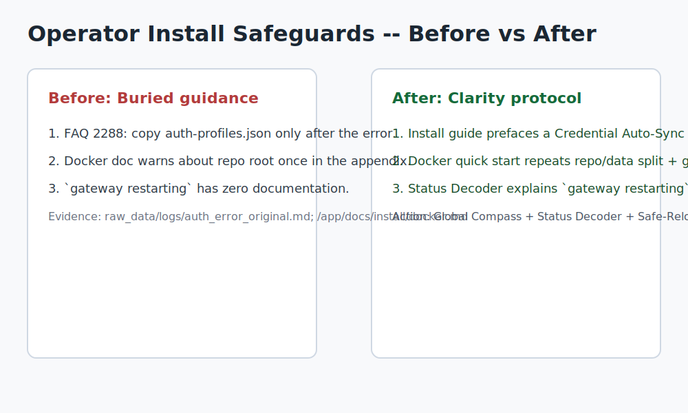

# Issue: Phase 4 Docs-First Safety Net for Founder Installs

> Maintainer TL;DR: we’re simply surfacing the existing FAQ 2288 guidance and docker root note inside `/docs/install/docker.md`, so founders see it before things explode.

## Summary
- **Persona:** Li Yidong — an M4 MacBook Air power user running OpenClaw full time to dogfood multi-agent workflows.
- **Problem:** The install experience hides three “hidden gems” (FAQ line 2288, docker note, config lint guidance) so well that every fresh founder still hits them as fatal traps. We want to surface, not replace, the official logic.
- **Goal:** Land a docs-first pull request that codifies these mitigations while Phase 4 ships native enforcement (auth sync, config guard, path integrity, health dashboard).

## Visual comparison (official vs clarity layer)
| Current official wording | Result after clarity patch |
| --- | --- |
| FAQ line 2288 only says “copy `auth-profiles.json` after the error appears.” | Install docs add a **Credential Auto-Sync** checklist so founders hash-compare / symlink before spawning subagents. |
| `/docs/install/docker.md` mentions “run `docker compose` from repo root” once in the manual appendix. | Quick start + troubleshooting both repeat “repo root ≠ `~/.openclaw`” and include a guard snippet that aborts when PWD is wrong. |
| `gateway restarting` has zero documentation. | The new Status Decoder marks it as “config lint failure,” walks through `python3 -m json.tool`/`jq` validation, and links to rollback steps (with an optional experimental config-guard flow). |



```
BEFORE (following FAQ 2288 as-is)
$ openclaw agents spawn helper
No API key found for provider "anthropic"
^^ FAQ only says “copy auth-profiles.json” after it blows up

AFTER (Global Compass + Status Decoder)
$ openclaw agents spawn helper
Auth sync check: hash match (OK)
Gateway status: healthy (linted via python3 -m json.tool)
>> Status decoder points to rollback commands instead of endless restarts
```

## Hidden gems to surface (with evidence)

### 1. Subagent auth isolation silently desyncs credentials
- **Observed behavior:** Subagents inherit stale `auth-profiles.json` snapshots under `~/.openclaw/agents/*`, producing `No API key for provider "anthropic"` the moment a helper boots.
- **Evidence:** `raw_data/logs/auth_error_original.md` → *Case 1: Subagent Auth Desync* (lines 4-8) captures the exact failure and path.
- **Impact:** Every fresh spawn fails regardless of the root config, forcing founders to diff hidden directories.
- **Current official coverage:** `/app/docs/help/faq.md` (“No API key found for provider after adding a new agent”) contains a hidden gem: copy `auth-profiles.json` post-failure. Great advice, but buried.
- **Gap:** No proactive warning or hash-sync workflow in install/onboarding docs, so founders repeat the trap.
- **Requested remedy:** Ship a “Credential Auto-Sync Protocol” section plus a status checklist that tells users to hash-compare the per-agent `auth-profiles.json` files until the gateway syncs them automatically.

### 2. Docker path shadowing trains users to run compose in the wrong tree
- **Observed behavior:** The CLI encourages running `docker compose` from `~/.openclaw`, but compose files live in the repo checkout. Running from the data directory produces `docker compose: not found` or mount explosions.
- **Evidence:** `raw_data/logs/auth_error_original.md` → *Case 2: Docker Path Shadowing* (lines 10-15).
- **Impact:** Install success becomes a coin flip because bind mounts break silently.
- **Current official coverage:** `/app/docs/install/docker.md` mentions “run docker compose ... from the repo root” once in the manual-flow appendix.
- **Gap:** Quick start, requirements, and troubleshooting never mention repo vs data root; no guard snippet prevents mistakes.
- **Requested remedy:** Update `/docs/install/docker.md` so repo/data split guidance appears in quick start + troubleshooting, plus add a guard snippet that bails when `pwd` equals `~/.openclaw`.

### 3. Config hot-reload suicide bricks healthy gateways
- **Observed behavior:** Editing `~/.openclaw/openclaw.json` with an unknown key loops `gateway restarting` forever; no lint or rollback hook.
- **Evidence:** `raw_data/logs/auth_error_original.md` → *Case 3: JSON Schema Suicide* (lines 17-23) plus the connection-refused excerpts.
- **Impact:** One stray key nukes production; founders can’t recover without manual surgery.
- **Current official coverage:** None—docs never mention linting `openclaw.json`, keeping rolling backups, or mapping `gateway restarting` to schema errors.
- **Gap:** Founders receive zero guidance once the loop starts.
- **Requested remedy:** Publish the Safe-Reload protocol (dry-run lint + limited backup history) until `openclaw config lint` ships. Docs should walk users through native lint flows (`python3 -m json.tool`, `jq`, manual backup/restore). Experimental helpers (auth-sync, config-guard) live in our tooling repo and will be proposed separately once maintainers bless the docs—we see them as a collaborative experiment with maintainers, not a fait accompli.

## Proposed resolution (docs-first)
1. **Credential Auto-Sync Protocol** — add a section under the Auth docs explaining the hash-compare workflow and referencing the automation plan.
2. **Execution Path Integrity Protocol** — update Docker install docs with repo/data split callouts, shell snippets, and pre-flight checks.
3. **Safe-Reload Protocol** — fold the dry-run validator + rolling backup guidance into the install/operations docs, referencing the experimental tooling as an optional add-on.
4. **Visual Health Dashboard Protocol** — summarize the layered status view so founders can interpret `gateway restarting`, `token mismatch`, etc.

## Acceptance criteria
- Maintainers acknowledge the hidden gems as P0 doc issues.
- Docs PR (referenced here) is accepted or receives actionable feedback.
- Follow-up code issues can reuse the same evidence so implementation owners are unblocked.

## Links
- Supporting logs: [`raw_data/logs/auth_error_original.md`](./raw_data/logs/auth_error_original.md)
- Draft mitigation guides: `docs/install/docker.md`, `docs/install/status-playbook.md`, `docs/install/phase4-protocols.md`
